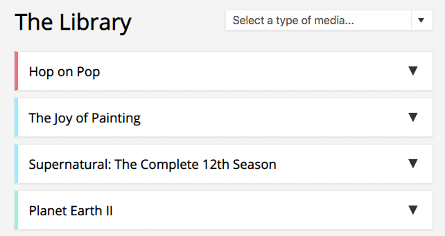
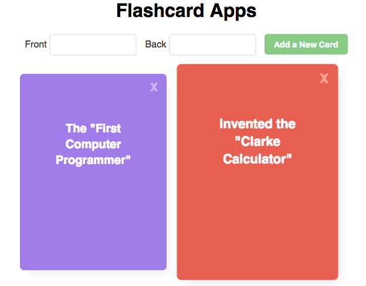

<h1 float="right">VueJS Playground</h1>

This is me exploring, playing and messing around with the beautiful super-scalable front-end JavaScript Framework [VueJS](https://vuejs.org/).

## Ingredients

### [Intro](/intro)

This is just me getting started with VueJS, using VueJS basic stuff like `v-show`, `v-if` and `new Vue({})` etc.

### [Accordion](/accordion)

A little media library with filter function and toggling more details.

### [Flashcards](./intro)

Simple flashcard application with add/remove card function, flipping cards and error handling.

## Getting Started

These instructions will get you a copy of the project up and running on your local machine for development and testing purposes. 

- Clone or Download this repository. 
- Open one of the subfolders `index.html`'s to see the magic happen. 

### Prerequisites

None. Just a modern WebBrowser with `JavaScript` enabled.

## Acknowledgments

* [Treehouse.com](https://teamtreehouse.com/)
* [VueJS](https://vuejs.org/).

